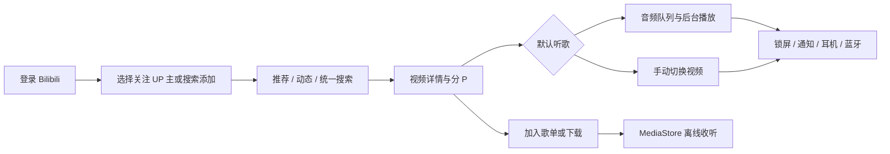

<div align="center">

<h1>BiuApp</h1>
<h3>把 B 站的歌曲合集，变成一台随身音乐播放器</h3>

<p>
面向 Android 的 Bilibili 听歌工具：从关注的 UP 主和自选来源发现歌曲，按曲目整理，<br>
交给系统媒体会话连续播放，也可以下载到本地离线收听。
</p>

<p>
  <a href="https://developer.android.com/about/versions/oreo"></a>
  <a href="https://kotlinlang.org/"></a>
  <a href="https://github.com/lonnnnnng/biu/blob/master/LICENSE"></a>
</p>

<p>
  <a href="https://github.com/lonnnnnng/biuapp/releases">私有 Releases</a> ·
  <a href="CHANGELOG.md">查看版本记录</a> ·
  <a href="https://github.com/lonnnnnng/biuapp/issues">提交问题</a>
</p>

</div>

> 当前稳定版：**0.1.25**。BiuApp 的主线是“听歌”，视频播放是手动切换的补充模式；它不是完整的 Bilibili 社区客户端。

## 你可以用它做什么

| 场景 | 体验 |
| --- | --- |
| 找歌 | 浏览热门、每周必看、全站排行、入站必刷，或只看自己关注/手动添加的 UP 主 |
| 整理 | 收藏夹、视频合集、在线历史、本地历史和本地歌单统一进入音乐库 |
| 收听 | 默认提取 Bilibili 音频轨，支持队列、倍速、循环、进度拖动和睡眠定时 |
| 离线 | 音频、当前分 P 视频和收藏夹批量下载，支持断点、暂停、恢复和失败重试 |
| 控制 | 后台、锁屏、通知栏、桌面小组件、耳机和蓝牙媒体按键共享同一播放状态 |
| 对照 | 单 P 与多 P 都按“可播放曲目”处理，歌词、历史、队列和下载不会混淆 |

## 核心能力

### 发现：只把真正想听的内容放进首页

- 推荐页默认提供 **综合热门 / 每周必看 / 全站排行 / 入站必刷** 四个来源，并支持下拉刷新、上滑加载更多。
- 配置首页内容范围后，可以从“我的关注”预选 UP 主，也可以按名称搜索并加入其他 UP 主；每个 UP 主独立成为一个 Tab，投稿按发布时间倒排并分页加载。
- 动态页支持下拉刷新、游标分页、播放、点赞/取消点赞，以及带确认提示的一键三连流程。
- 统一搜索覆盖视频、UP 主、已配置来源合集和本地歌单；视频支持综合/最新排序、分页和搜索记录恢复。

### 整理：账号音乐库与本地音乐库分层呈现

账号页先按数据来源分成 **在线 / 本地 / 下载** 三个一级 Tab，再展示对应的二级内容：

1. **在线 · 收藏夹**：我创建的、我收藏的、普通收藏夹和视频合集；分组默认收起。
2. **在线 · 历史**：把账号在线历史和 Room 本地历史合并到同一页面，可按全部/在线/本地筛选，并支持搜索、单条删除和按范围清空。
3. **本地 · 歌单**：混合保存 Bilibili 单 P、具体分 P 和手机本地音频，支持重命名、排序、移除和整组播放。
4. **本地 · 本地音乐**：扫描 MediaStore 音频，也可通过 Android 10+ SAF 选择目录并筛选子目录。
5. **下载**：统一管理音频和视频任务、断点、网络约束、失败重试与本地播放。

播放进度、播放次数和最近收听内容保存在 Room；页面切换后仍能从统一历史或本地歌单继续收听。

### 播放：默认听歌，想看时再切到视频

- 默认模式只加载音频轨，优先使用最高可用音质，不提供省流量档位；当前轨不可用时自动降级。
- 播放队列支持顺序、列表循环、随机、单曲循环，`0.5x`–`2.0x` 七档倍速，设为下一首、移动、批量移除、清空和保存为本地歌单。
- 当前源码新增可关闭的播放/暂停/切歌淡入淡出，以及关闭、轻柔、标准、明显四档音量平衡；系统音频效果不可用时自动保持原始声音。
- 点击底部迷你播放栏进入全屏播放页；播放列表默认收起，从进度条右上方按钮打开底部可滚动弹层。
- 切换到视频后，竖屏使用贴齐屏幕的 16:9 小窗，横屏进入沉浸式全屏；两种形态都支持播放/暂停、上一首/下一首、进度拖动、倍速、实际可用画质和方向切换。
- 视频画面支持横向滑动快进/快退，拖动期间预览目标时间，抬手后统一 seek，降低误触和频繁请求。
- Media3 `MediaSessionService` 负责后台播放，锁屏和通知栏显示当前曲目；多 P 时显示当前 P 的标题，点击系统媒体通知或厂商灵动岛可返回应用。

### 多 P：每个 P 都是一首独立曲目

BiuApp 使用 `bvid + cid` 作为曲目稳定身份，而不是只使用主视频 ID：

```text
视频详情
  ├─ P1：独立解析、播放、历史、歌词和下载
  ├─ P2：独立解析、播放、历史、歌词和下载
  └─ …
```

选择多 P 内容时，可以“仅播放此 P”“从此 P 开始”或“加入当前队列”。队列采用渐进解析：先让当前 P 尽快起播，再按原页面顺序补齐前后曲目；某个 P 失效时跳过它，不阻断其他曲目。单 P 长视频仍只提供连续进度拖动，不推断视频内部歌曲边界。

### 离线：下载完成后回到系统媒体库

- 音频下载到 `Music/Biu/`，视频下载到 `Movies/Biu/`，通过 MediaStore 发布为系统可见媒体。
- 支持单曲、当前分 P、收藏夹批量下载；多 P 会按每个 P 拆成独立任务。
- 下载任务写入 Room，由独立前台服务串行执行，支持 Range 断点续传、暂停、继续、取消、失败重试。
- 可选择任意已验证网络，或仅允许非计费网络；网络不满足条件时保留断点并自动等待恢复。
- 推荐、搜索、动态、收藏夹、历史、歌单和 UP 主投稿统一显示下载状态；网络不可用或线上地址失效时优先播放已经发布的本地副本。

### 歌词：手动确认，缓存后一步打开

- 点击歌词按钮后才发起搜索，不在打开播放页或切歌时自动请求。
- 使用独立的 [LRCLIB](https://lrclib.net/) 客户端，弹框默认填入歌曲名和歌手，用户可以修改并从候选结果中确认。
- Room 缓存当前选择，支持每曲时间偏移、标准/大/小字号、同时间戳双语合并、当前行高亮和自动滚动。
- 多 P 使用当前 P 名称搜索和展示；单 P 使用资源标题。
- 不使用 Bilibili 字幕接口作为歌词来源。

### 界面与显示：为手机上的高频收听而设计

- 支持亮色、暗色和跟随系统三种主题，状态栏、导航栏与系统手势区同步适配。
- 应用字号提供小号/标准/大号，媒体列表提供标准/紧凑密度；推荐和搜索结果可以切换列表或自适应网格。
- 播放、下载状态不只依赖颜色表达，关键图标提供内容描述并保留可用触控区域。
- 桌面播放小组件根据宽度切换紧凑/展开布局，显示封面、当前曲目或分 P、UP 主与进度，并提供上一首、播放/暂停、下一首和返回应用。

## 从打开到连续收听



## 安装

### 从私有 Releases 安装正式 APK

1. 使用具有仓库访问权限的 GitHub 账号打开[私有 Releases](https://github.com/lonnnnnng/biuapp/releases)。
2. 下载当前稳定版 `BiuApp-v0.1.25.apk`，或选择最新版本中的同名 APK 资产。
3. 在 Android 系统中允许当前安装来源后完成安装。

由于仓库已经改为私有，BiuApp 不再内置 GitHub 版本检查、APK 下载或安装入口。后续升级由仓库成员从私有 Releases 手动下载安装。

当前版本信息：

- `versionName`：`0.1.25`
- `versionCode`：`26`
- `applicationId`：`com.lonnnnnng.biu`
- 最低版本：Android 8.0 / API 26
- 目标版本：Android 16 / API 36
- APK SHA-256：发布时随 `SHA256SUMS` 提供（当前本地 Debug 构建：`dc0194019e159d60746b96cf389ea8d01b9a895f69b08a60aeb2b15054b093b1`）

浏览默认推荐和公开搜索不强制登录；关注列表、收藏夹、在线历史和账号互动需要通过 Bilibili H5 登录建立账号态。通知权限用于媒体控制和下载进度；读取本地音乐与选择 SAF 目录均在用户主动使用对应功能时请求。

## 本地开发与构建

### 环境

- Android Studio（可使用项目自带 Gradle Wrapper）
- JDK 21
- Android SDK Platform 36、对应 Build Tools
- Kotlin / Jetpack Compose / Material 3

### 常用命令

在 `android-app` 目录执行：

```zsh
# 单元测试、Lint 和 Debug APK
./gradlew --no-daemon :app:testDebugUnitTest :app:lintDebug :app:assembleDebug

# 仅构建 Release APK（签名配置由本地环境决定）
./gradlew --no-daemon :app:assembleRelease
```

macOS 本机也可以直接使用项目当前的 SDK/JDK：

```zsh
ANDROID_HOME=/Users/long/Library/Android/sdk \
JAVA_HOME="/Applications/Android Studio.app/Contents/jbr/Contents/Home" \
bash ./gradlew --no-daemon :app:testDebugUnitTest :app:lintDebug :app:assembleDebug
```

Debug APK 输出：`app/build/outputs/apk/debug/app-debug.apk`。

### 代码结构

```text
app/src/main/java/com/lonnnnnng/biu/
├── core/model        领域模型、曲目身份与播放模式
├── data/bilibili     Bilibili API、Cookie、WBI、响应模型
├── data/local        Room 数据库、DAO、历史、队列和下载索引
├── data/lyrics       LRCLIB 查询、LRC 解析和歌词缓存
├── playback          Media3 播放服务、MediaSession 与媒体状态
├── download          前台下载服务、断点传输、合并与 MediaStore 发布
├── widget            RemoteViews 桌面播放小组件与 MediaSession 控制
└── ui                Jetpack Compose 页面、ViewModel、主题和交互
```

UI 只通过 ViewModel/StateFlow 发出业务意图，不直接持有 ExoPlayer；播放命令统一进入 `PlaybackService`，因此 Activity 被回收后仍能保持媒体会话和队列状态。

## 技术方案速览

| 层次 | 当前实现 |
| --- | --- |
| UI | Kotlin、Jetpack Compose、Material 3、响应式列表/网格、亮色/暗色/跟随系统 |
| 网络 | OkHttp、Bilibili 专用请求头与 Cookie 隔离、WBI 签名、DASH 解析 |
| 播放 | AndroidX Media3 / ExoPlayer、`MediaSessionService`、`MergingMediaSource`、淡入淡出与系统音量平衡 |
| 状态 | ViewModel + StateFlow；Room 保存历史、队列、歌单和下载任务；DataStore 保存轻量设置 |
| 存储 | MediaStore、SAF 持久授权、应用私有临时文件 |
| 下载 | 独立 `dataSync` 前台服务、Range 续传、音视频轨合并、失败恢复 |

## 隐私、安全与合规

- Cookie 和手机号属于敏感数据，不写入普通日志、Crash 报告、Room 或 DataStore；当前登录态由 WebView `CookieManager` 保存在应用沙箱中。
- 只有 Bilibili 专用客户端会携带 Bilibili Cookie、Referer、Origin 和 User-Agent；LRCLIB 与图片请求不共享登录凭据。
- 网络请求保持 HTTPS 和系统证书校验，不提供忽略证书错误或绕过风控的调试后门。
- 下载文件通过 MediaStore 的 `IS_PENDING` 和相对目录发布，不扫描或上传用户的裸文件路径。
- 使用 Bilibili 账号、接口、内容和下载能力时，请遵守 Bilibili 平台协议、版权规则及所在地法律法规；项目不实现绕过会员、DRM 或风控限制的功能。

## 当前验证状态

`0.1.25` 已针对 Redmi Note 8 Pro 真机 `wsvwypiz7xwslvl7` 的锁屏多 P 播放链路完成代码修复：服务层区分用户播放意图与瞬时音频焦点状态，媒体项转场后主动补播并延迟重试；应用内上一曲/下一曲无论原状态均立即播放。工程门禁已通过，待真机完成完整锁屏与灵动岛长时验收。

`0.1.21` 已通过 Redmi Note 8 Pro 真机 `wsvwypiz7xwslvl7` 验收：账号态、音频后台播放、淡入淡出与四档音量平衡设置恢复、4×2 桌面小组件添加与真实状态展示、三项媒体控制、点击内容回到应用，以及 Biu 进程为空时由小组件冷启动并从 Room 恢复当前曲目均已验证。播放过程中一次 CDN TLS 读取超时由服务自动恢复，最终 MediaSession `error=null`，crash buffer 无 BiuApp 崩溃。

发布包均完成正式证书签名、APK 对齐、签名校验和私有 GitHub Release 资产复核。`v0.1.20` 及更早版本的历史证据保持不变：

- JVM 单元测试、Android Lint、Debug/Release APK 构建。
- 真机验证：Bilibili 登录、推荐与搜索、DASH 音频播放、后台播放、通知栏/锁屏媒体控制、账号音乐库、主题与显示密度。
- 模拟器验证：首页来源配置、UP 主投稿分页、MediaStore/SAF 本地音乐、下载断点和网络约束、队列/播放模式/倍速的进程恢复。
- 发布包完成 APK 对齐、签名和 GitHub Release 资产校验。

不同 Android 厂商的后台限制、编解码器和 Bilibili 账号权限可能影响实际体验；遇到问题时请附上设备型号、Android 版本、应用版本和可复现步骤。

## 明确边界与后续评估

以下内容不是当前版本的已完成能力：

- 不提供“稍后再看”页面入口。
- 不提供手动高/中/低音质档位，统一最高可用音质并自动降级。
- 不恢复 Bilibili 字幕接口作为歌词来源。
- 不做设置导入/导出。
- 不以评论、私信、图文社区浏览为主线。
- 系统画中画、低功耗音频频谱、自定义下载目录、空间占用统计、封面下载和自定义主题色/字体仍待逐项评估。
- Android Auto 已完成可行性、媒体树和权限边界评估，但当前尚未迁移为 `MediaLibraryService`，车机浏览与语音播放仍不可用。
- 一键三连保留确认和风控提示；涉及真实扣币的不可逆场景需要单独授权验收。

## 项目文档

- [产品路线图](docs/product-roadmap.md)
- [开发里程碑](docs/development-roadmap.md)
- [桌面端与 Android 功能迁移矩阵](docs/feature-migration-matrix.md)
- [桌面端与 Android 功能差异审计](docs/desktop-android-feature-gap-audit.md)
- [Android Auto 可行性评估](docs/android-auto-feasibility.md)
- [技术方案](docs/technical-solution.md)
- [UI 设计规范](docs/ui-design-system.md)
- [安全与合规边界](docs/security-and-compliance.md)
- [版本记录](CHANGELOG.md)

## 许可与致谢

Android 目录当前没有单独的 `LICENSE` 文件。本项目是 [Biu 桌面端项目](https://github.com/lonnnnnng/biu) 的 Android 派生实现，许可边界请以桌面端仓库中的 [PolyForm Noncommercial 1.0.0](https://github.com/lonnnnnng/biu/blob/master/LICENSE) 和 Required Notice 为准；在分发或制作衍生版本前，请先完整阅读许可证文本。

Bilibili、相关服务名称及其商标归各自权利人所有。本项目仅供个人学习、研究和非商业使用。
